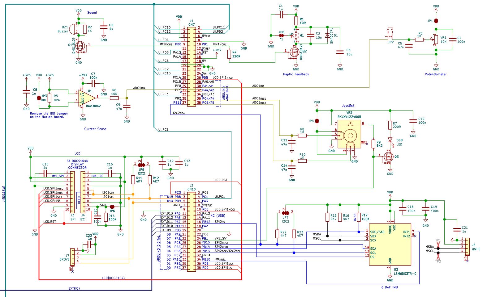

# Step-Counter

A personal step counter implemented on the STM32 Nucleo + IMU expansion board.

## Features

- **Step Detection**: Counts steps using the onboard accelerometer  
- **Distance Tracking**: Converts steps to distance (0.9 m per step)  
- **Step Goals**: Set and display progress toward a user-defined goal  
- **Alerts**: Notifies when the goal is reached  
- **Reset**: Full reset (steps, distance, goal) via the Nucleo reset button  
- **Test Mode**:  
  - Enter by double-tapping SW2  
  - Use joystick to manually adjust step count  
  - Exit with another double tap  
- **Display Navigation**:  
  - Joystick left/right to cycle through Steps → Distance → Goal progress  
  - Joystick up toggles units (e.g. km ↔ yd or % goal)

## Getting Started

1. Clone this repo  
2. Open in STM32CubeIDE (or your preferred toolchain)  
3. Build and flash to the Nucleo board  
4. Enjoy tracking your steps!
