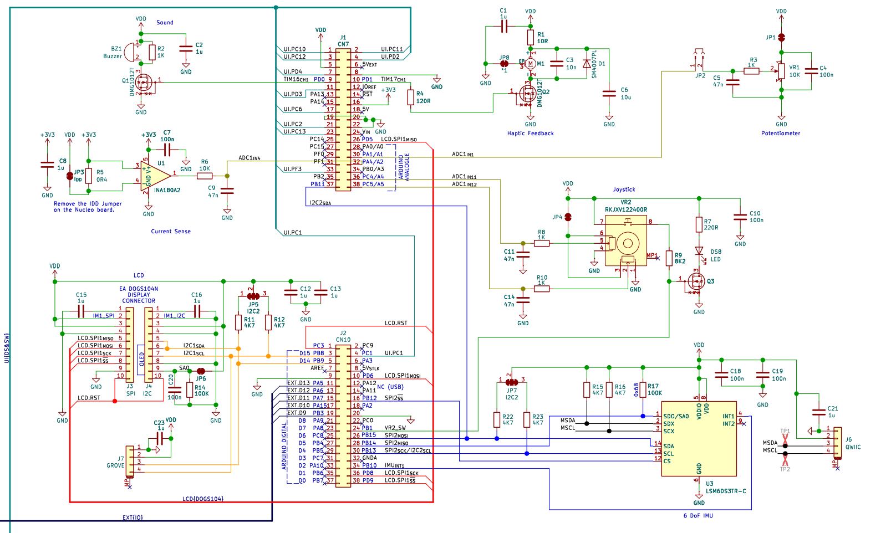
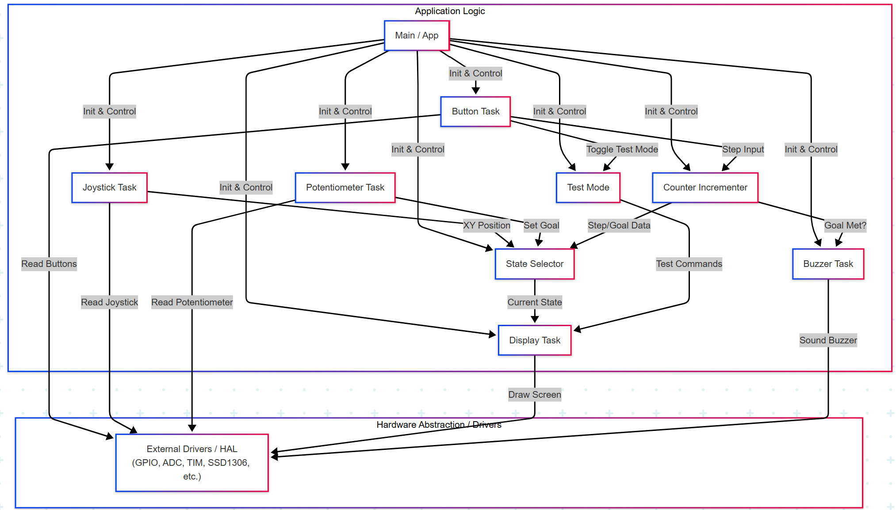

# Step-Counter  
Firmware for a step counter on an STM32 Nucleo Board, using an LSM6DS IMU for step detection and an SSD1306 OLED for display.

## 1. Project Overview

This project implements a step counter on an STM32 microcontroller with an LSM6DS IMU. It processes sensor data and displays information like step count, distance, and goals on an SSD1306 OLED screen. The hardware setup is detailed in the schematic below:

Key features:
- **Step Detection:** Uses filtered 3-axis accelerometer data and a peak detection algorithm.
- **Data Display:** OLED screen shows step count, distance (km/yards), step goal, goal progress, and joystick status.
- **User Interaction:** Joystick for menu navigation, display mode selection, and goal editing. Hardware buttons for manual step increment, UART diagnostics toggle, and test mode activation.
- **Step Goal Management:** User-settable daily step goal with potentiometer editing and achievement feedback.
- **Audible Feedback:** Buzzer alerts for events like goal achievement.
- **Test Mode:** Simulates step input via joystick for debugging.
- **Serial Data Output:** UART transmission of telemetry data, toggled by a button.
- **Visual Feedback:** RGB and onboard LEDs for status indication.

The system employs a modular C-based design for clarity and maintainability.

## 2. Code Structure and Modularisation

The firmware is organised into distinct modules, each responsible for specific functionalities. This modular approach improves code organization, readability, and allows for easier maintenance and independent development. The diagram below illustrates module interactions and data flow:

Key module categories include:
- **Core Application Logic (`app.c`, `main.c`):** Initializes system and orchestrates tasks.
- **Sensor & Data Processing (`imu_sensor.c`, `peak_detect.c`, `noise_filter.c`):** Handles IMU data acquisition. Raw accelerometer readings are smoothed by a moving-average filter (`noise_filter.c`) to reduce sensor noise. The `peak_detect.c` module then processes this filtered data, calculating the squared magnitude of the 3-axis acceleration. A step is registered when this magnitude crosses a predefined threshold with a rising edge, incorporating hysteresis to prevent false positives, as illustrated in the graph below.
  
- **User Interface & Display (`display.c`, `state_selector.c`, `ssd1306` library):** Manages OLED display content and UI state transitions.
- **Input Handling (`joystick_task.c`, `button_task.c`, `buttons.c`, `potentiometer.c`):** Processes inputs from joystick, buttons, and potentiometer.
- **Feature Modules (`counter_incrementer.c`, `test_mode.c`, `buzzer.c`, `serial.c`):** Implements step counting, goal management, test functionalities, alerts, and serial communication.
- **Low-Level Control (`rgb.c`, `pwm.c`, `led_blinking.c`, `blinky.c`):** Manages LEDs and PWM outputs.
- **Hardware Abstraction (STM32CubeMX generated HAL files):** Provides low-level drivers for MCU peripherals.

## 3. Performance Overview

The firmware uses a cooperative multitasking model. A main super-loop in `app_main` polls each module at a fixed rate.

### 3.1 Task Execution Times  
Execution times for key tasks were measured using Timer TIM2 (clocked at 48 MHz). The table below shows each task's duration in microseconds:

| Task                      | Freq (Hz) | Ticks Taken | Time per Call (µs)     |
|---------------------------|----------:|------------:|-----------------------:|
| button_task_execute       |       300 |       1 283 | 1 283 / 48 ≈ 26.7       |
| buzzer_execute            |         2 |         134 |   134 / 48 ≈ 2.8        |
| display_execute           |         4 |      30 574 | 30 574 / 48 ≈ 636.5     |
| joystick_task_execute     |        20 |         790 |   790 / 48 ≈ 16.5       |
| test_mode_execute         |        20 |         853 |   853 / 48 ≈ 17.8       |
| serial_task_execute       |       500 |      36 844 | 36 844 / 48 ≈ 768.4     |

### 3.2 Task Responsiveness  
Each task must complete within its allocated period to ensure the system runs smoothly. The following table confirms that all tasks meet their respective deadlines:

| Task                    | Period \(P_k\) | Exec. time \(T_k\) | Meets deadline? |
|-------------------------|--------------:|-------------------:|:---------------:|
| button_task_execute     | 3.33 ms       | 0.027 ms           | ✓               |
| buzzer_execute          | 500 ms        | 0.003 ms           | ✓               |
| display_execute         | 250 ms        | 0.637 ms           | ✓               |
| joystick_task_execute   | 50 ms         | 0.016 ms           | ✓               |
| test_mode_execute       | 50 ms         | 0.018 ms           | ✓               |
| serial_task_execute     | 2 ms          | 0.768 ms           | ✓               |

### 3.3 CPU Load  
The CPU load for each task (`L_k = T_k × F_k`) and the total system load (`L_tot = sum(L_k)`) are detailed below:

| Task                    | \(T_k\) (s)        | \(F_k\) (Hz) | \(L_k=T_kF_k\)       |
|-------------------------|---------------:|-------------:|---------------------:|
| button_task_execute     | 0.0000267         |        300   | 0.0080 (0.8 %)       |
| buzzer_execute          | 0.0000028         |          2   | 0.000006 (0.0006 %)  |
| display_execute         | 0.0006365         |          4   | 0.00255 (0.25 %)     |
| joystick_task_execute   | 0.0000165         |         20   | 0.00033 (0.033 %)    |
| test_mode_execute       | 0.0000178         |         20   | 0.00036 (0.036 %)    |
| serial_task_execute     | 0.0007684         |        500   | 0.3842 (38.4 %)      |

L_tot ≈ 0.0080 + 0.000006 + 0.00255 + 0.00033 + 0.00036 + 0.3842 ≈ 0.3955 < 1

The total CPU load is approximately 40%. This indicates that the system is schedulable and has significant headroom (around 60%) for future extensions or more demanding tasks. All tasks comfortably meet their deadlines.

## 4. Summary and Future Enhancements

This firmware provides a responsive step counting solution with a clear, modular design. Key performance aspects include:
- All tasks execute well within their timing budgets.
- The overall CPU load is low, allowing for future expansion.
- The modular design aids in maintenance and further development.

**Potential future enhancements** could include:
- Optimizing the most time-critical code paths (e.g., UART transmit) via DMA.  
- Adding dynamic power management during idle periods.  
- Extending the scheduler to support occasional higher-priority tasks (e.g., Bluetooth or higher-rate sampling).
